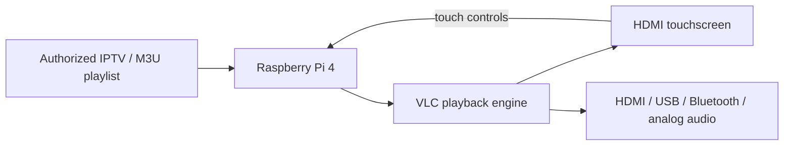

# Pocket IPTV

A portable touchscreen IPTV player. **Version 2 now defaults to a Raspberry Pi 4 + HDMI touchscreen** because it is much easier to build, faster, smoother, and more reliable than the original Pi Zero 2 W + ESP32 Cheap Yellow Display design.

## Recommended build: Raspberry Pi 4 touchscreen

The Pi 4 handles the whole job by itself:

- full-motion VLC video playback
- touchscreen channel browser
- search and channel groups
- favorites
- previous / play-pause / next controls
- volume and mute
- M3U import from the screen
- automatic reconnect attempts
- 2.4 GHz and 5 GHz Wi-Fi
- automatic launch after desktop login
- HDMI, USB, Bluetooth, or analog audio

There is **no ESP32 firmware, USB serial bridge, JPEG frame conversion, or separate CYD speaker wiring** in the recommended build.

Start here:

1. Read [SHOPPING_LIST.md](SHOPPING_LIST.md).
2. Follow [QUICKSTART.md](QUICKSTART.md).
3. The Pi 4 software and troubleshooting notes are in [pi4/README.md](pi4/README.md).

## One-command software install

After Raspberry Pi OS Desktop is running:

```bash
git clone https://github.com/duhfreakinduh/pocket-iptv-cyd.git
cd pocket-iptv-cyd
bash pi4/install.sh
```

The app installs to `~/PocketIPTV` and starts automatically after desktop login.

## What you need

- Raspberry Pi 4 Model B, 2 GB RAM or better
- 5-inch or 7-inch HDMI touchscreen
- 32 GB+ microSD card
- 5 V / 3 A USB-C power supply
- HDMI connection to the display
- USB touch cable from display to Pi
- optional 10,000 mAh power bank for portable use

## Supported streams

Pocket IPTV is designed for ordinary non-DRM streams that VLC can open, including many HLS/M3U8, HTTP, RTSP, and local media sources. It does not supply channels, scrape credentials, decrypt DRM, or bypass subscriptions. Use only streams you are authorized to watch.

## Legacy Pi Zero + CYD build

The original Pi Zero 2 W + ESP32-2432S028R project is still preserved in this repository for anyone who wants the ultra-small hardware experiment. Its files remain under `pi/`, `firmware/`, and the older docs.

That version intentionally runs low-resolution JPEG video over USB serial and is much more difficult to assemble. For a player you actually want to use every day, build the Pi 4 touchscreen version above.

## Repository map

| Path | Purpose |
| --- | --- |
| `pi4/` | Recommended Raspberry Pi 4 touchscreen player and installer |
| `pi/` | Legacy Pi Zero 2 W backend |
| `firmware/` | Legacy ESP32 CYD firmware |
| `setup-wizard/` | Optional playlist/config tooling from the original build |
| `docs/` | Legacy architecture, wiring, and troubleshooting notes |

## Version 2 architecture



See [LEGAL_AND_SAFETY.md](LEGAL_AND_SAFETY.md) for the project boundary.
