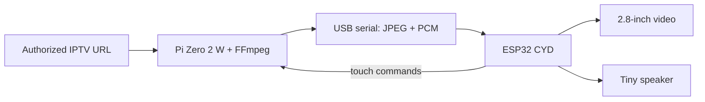

# Pocket IPTV CYD

A tiny portable IPTV player built from a **Raspberry Pi Zero 2 W** and the
common **ESP32-2432S028R 2.8-inch Cheap Yellow Display (CYD)**.

The Raspberry Pi does the hard work: it opens an authorized HLS/IPTV stream,
decodes it with FFmpeg, shrinks it to 320x240, and sends JPEG video plus mono
audio over one USB cable. The ESP32 draws the video, plays audio through the
CYD speaker connector, and sends touchscreen commands back to the Pi.

## What the finished player does

- Plays ordinary non-DRM HLS/HTTP streams from an M3U playlist.
- Uses your phone's **2.4 GHz hotspot** away from home.
- Shows 320x240 video at a target 6-10 frames per second.
- Plays mono audio through a tiny 8-ohm speaker connected to the CYD.
- Touch controls: previous, pause/live, next, volume down, and volume up.
- Local phone control page at `http://pocketiptv.local:8080`.
- PIN-protected playlist upload and channel selection.
- Keeps IPTV URLs and credentials on your Pi.

## Honest limitations

This is a fun pocket TV, not a replacement for a phone or commercial streaming
device. The original ESP32 CYD has limited RAM and a serial USB bridge, so the
video is intentionally low frame rate and mono. DRM services such as Netflix,
Hulu, Disney+, and most paid-app video cannot be played by this project. It
does not include channels or bypass subscriptions. Use only streams you are
authorized to watch.

## The exact board this release targets

- Raspberry Pi **Zero 2 W**, not the original single-core Zero W.
- CYD model **ESP32-2432S028R**, 2.8-inch, 240x320, resistive touch.
- Default firmware profile: **ILI9341** display controller.
- An alternate ST7789 build profile is included for newer two-USB revisions.

The board name must match. Similar-looking 3.2-inch, 3.5-inch, capacitive-touch,
or ESP32-S3 boards need a different firmware profile.

## Start here

1. Read [SHOPPING_LIST.md](SHOPPING_LIST.md).
2. Follow [QUICKSTART.md](QUICKSTART.md).
3. Use [docs/WIRING.md](docs/WIRING.md) for the exact cable and speaker setup.
4. If anything fails, use [docs/TROUBLESHOOTING.md](docs/TROUBLESHOOTING.md).

The six-day build schedule is in [docs/WEEKEND_PLAN.md](docs/WEEKEND_PLAN.md).

## Repository map

| Folder | Purpose |
| --- | --- |
| `pi/` | Raspberry Pi player, web controller, service, and installer |
| `firmware/` | PlatformIO firmware for the ESP32 CYD |
| `setup-wizard/` | Optional local Hugging Face Gradio playlist/config builder |
| `docs/` | Wiring, architecture, build plan, and troubleshooting |
| `.github/workflows/` | Automated Python tests and firmware builds |

## Data path

## Support boundary

The software supports unencrypted, non-DRM streams that FFmpeg can open. It
does not obtain, scrape, decrypt, restream, or redistribute programming. See
[LEGAL_AND_SAFETY.md](LEGAL_AND_SAFETY.md).
