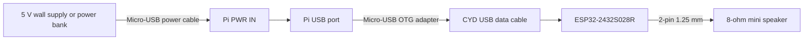

# Cable and speaker connections

No GPIO jumper wires are required in the default build.

## USB data/power path

## Exact steps with power off

1. Insert the microSD card in the Pi.
2. Plug the OTG adapter into the Pi's port labeled **USB**.
3. Plug the CYD USB data cable into the OTG adapter.
4. Plug the other end into the CYD.
5. Plug the 8-ohm speaker into the two-pin connector labeled `SPEAK` or `SPK`.
6. Plug the power cable into the Pi's separate **PWR IN** port.
7. Connect power last.

The Pi powers the CYD through USB. Do not also power the CYD from a second USB
supply while it is connected to the Pi.

## CYD revision check

The expected board is approximately 50 x 86 mm and says
`ESP32-2432S028R`. Common revisions use either Micro-USB, USB-C, or both. A
two-USB revision may use an ST7789 display controller even when the older board
uses ILI9341. The firmware includes both build profiles.

## Optional direct UART fallback

Use this only if the CYD USB bridge cannot sustain the stream. Both boards use
3.3 V logic; never connect a 5 V UART adapter.

| Raspberry Pi | CYD CN1 | Purpose |
| --- | --- | --- |
| Physical pin 8, GPIO14/TXD | GPIO22 | Pi transmit to CYD receive |
| Physical pin 10, GPIO15/RXD | GPIO27 | CYD transmit to Pi receive |
| Physical pin 6, GND | GND | Common ground |
| No connection | 3V3 | Leave disconnected |

The USB method is the supported easy-mode path in release 1.0.
